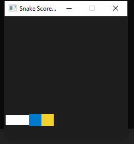

# CPPND: Capstone Snake Game Example

This is a submission for the Udacity C++ NanoDegree Capstone Project. It started with Udacity's starter code - which  was inspired by [this](https://codereview.stackexchange.com/questions/212296/snake-game-in-c-with-sdl) excellent StackOverflow post and set of responses.

The original project was modified/enhanced in the following ways :
1. Eliminated wraparound - the boundaries are now walls. This was inspired by Google's play-in-browser Snake game. But, running into the wall or the snake body does not result in death. It just necessitates a turn, if possible. If not possible, then it results in Game Over.
2. Automatic turning - when running into the body or the wall - the snake turns left by default, if possible. If a left turn is not possible, a right turn will be attempted. The player can always override the default turn. A "left" turn when traveling in the right-ward direction means the snake will then start moving up.
3. Speed no longer increases with food consumption - rather, when the snake is greater than 25 cells in length, speed is reduced 5% with each growth spurt till the length reaches 35 cells, after which speed stays constant. This has been found to give optimal player experience.
4. The body of the snake is rendered such that its outline is clearly visible.

Optional Rubric items addressed :

1. The project demonstrates an understanding of C++ functions and control structures.
- fulfilled in starter code? Yes
- enhanced? Yes
- Eg : renderer.cpp lines 78, 94, 110, 150 - new functions added. In the RenderBody (new) function, a loop that iterates backwards over a std::vector has been added

2. The project accepts user input and process the input.
- fulfilled in starter code? Yes
- enhanced? Yes - no additional keystrokes processed, but the very simple "change direction" in the starter code has been revised considerably
- new function Snake::ChangeDirection in snake.cpp line 195

3. The project uses Object Oriented Programming techniques.
- fulfilled in starter code? Yes
- enhanced? No - one class Point was added to simplify adding functionality, but no significant changes made along these lines. The starter code already meets this.

4. Classes use appropriate access specifiers for class members.
- fulfilled in starter code? No -- in the Snake class, several data members are public
- Implementation : all data members in Snake are now private with getters/setters. Refer lines 30-40 in snake.h

5. Class constructors utilize member initialization lists.
- fulfilled in starter code? Yes
- enhanced : No

6. Classes encapsulate behavior.
- fulfilled in starter code? No -- same reason as in (4) above
- Implementation : all data members in Snake now private.

7. Overloaded functions allow the same function to operate on different parameters.
- fulfilled in starter code? No
- Implementation : Renderer::Direction - refer renderer.cpp lines 78 - 100

8. The project makes use of references in function declarations.
- Implementation : The functions Renderer::RenderBlock and Renderer::RenderBody take the block parameter by reference - refere renderer.h lines 16-21
- Also, the getter for the Snake.body data member is as a const reference.

## Dependencies for Running Locally
* cmake >= 3.7
  * All OSes: [click here for installation instructions](https://cmake.org/install/)
* make >= 4.1 (Linux, Mac), 3.81 (Windows)
  * Linux: make is installed by default on most Linux distros
  * Mac: [install Xcode command line tools to get make](https://developer.apple.com/xcode/features/)
  * Windows: [Click here for installation instructions](http://gnuwin32.sourceforge.net/packages/make.htm)
* SDL2 >= 2.0
  * All installation instructions can be found [here](https://wiki.libsdl.org/Installation)
  * Note that for Linux, an `apt` or `apt-get` installation is preferred to building from source.
* gcc/g++ >= 5.4
  * Linux: gcc / g++ is installed by default on most Linux distros
  * Mac: same deal as make - [install Xcode command line tools](https://developer.apple.com/xcode/features/)
  * Windows: recommend using [MinGW](http://www.mingw.org/)

## Basic Build Instructions

1. Clone this repo.
2. Make a build directory in the top level directory: `mkdir build && cd build`
3. Compile: `cmake .. && make`
4. Run it: `./SnakeGame`.
